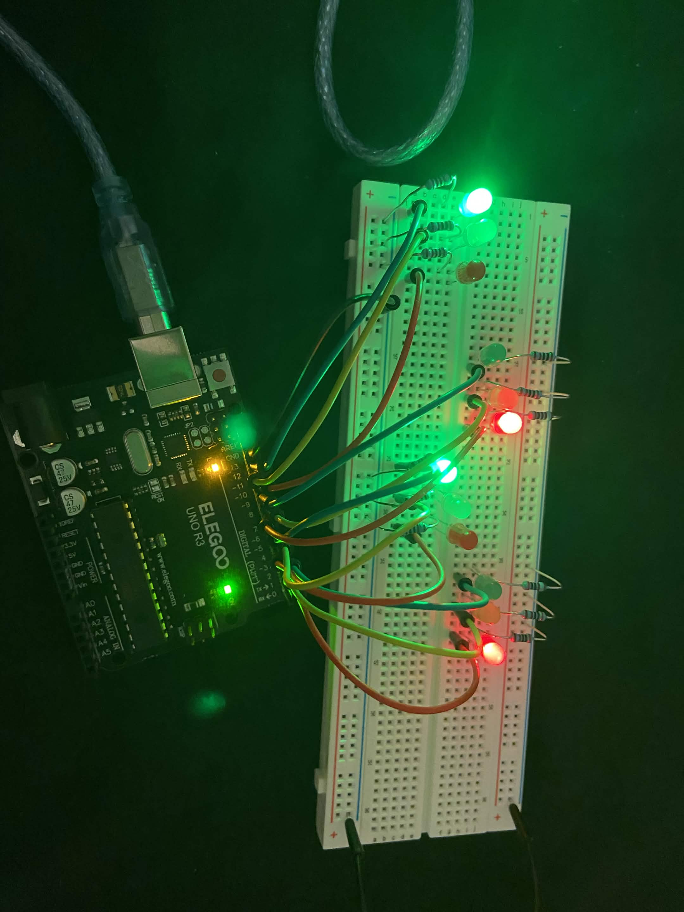

# 4-Way Traffic Light Simulation

An Arduino UNO R3 project simulating a 4-way intersection's traffic light system — North, East, South, and West each get their own green/yellow/red LED set, cycling through a realistic light sequence so opposing roads (North/South vs. East/West) alternate right-of-way.

## How it works

Each of the 4 "roads" has its own green, yellow, and red LED, for 12 LEDs total. The sketch steps through a fixed sequence using `digitalWrite()` and `delay()`, cycling the whole intersection through 6 phases:

| Phase | North (Road 1) | East (Road 2) | South (Road 3) | West (Road 4) | Duration |
|---|---|---|---|---|---|
| 1 | 🟢 Green | 🔴 Red | 🟢 Green | 🔴 Red | 3s |
| 2 | 🟡 Yellow | 🔴 Red | 🟡 Yellow | 🔴 Red | 3s |
| 3 | 🔴 Red | 🔴 Red | 🔴 Red | 🔴 Red | 1.5s (all-red clearance) |
| 4 | 🔴 Red | 🟢 Green | 🔴 Red | 🟢 Green | 3s |
| 5 | 🔴 Red | 🟡 Yellow | 🔴 Red | 🟡 Yellow | 3s |
| 6 | 🔴 Red | 🔴 Red | 🔴 Red | 🔴 Red | 1.5s (all-red clearance) |

North/South (Road 1 & 3) and East/West (Road 2 & 4) are paired so opposing directions share the same light state, just like a real intersection. After phase 6, the loop restarts at phase 1.

## Demo

## Components

- Arduino UNO R3 (ELEGOO)
- 12x LEDs (4 sets of green/yellow/red)
- 12x current-limiting resistors
- Breadboard + jumper wires

## Wiring

| Road | Green | Yellow | Red |
|---|---|---|---|
| Road 1 (North) | D13 | D12 | D11 |
| Road 2 (East) | D10 | D9 | D8 |
| Road 3 (South) | D7 | D6 | D5 |
| Road 4 (West) | D4 | D3 | D2 |

## Code

See [`src/traffic_light.ino`](src/traffic_light.ino).

Core logic:
- All 12 LED pins are set as `OUTPUT` in `setup()`
- `loop()` writes each phase's LED states with `digitalWrite()`, then holds with `delay()` before moving to the next phase
- The sequence repeats indefinitely since `loop()` runs continuously

## What I'd improve next

- Refactor the repeated `digitalWrite()` blocks into a helper function (e.g. `setRoad(pin_g, pin_y, pin_r, state)`) to shorten the code and reduce copy-paste errors
- Replace `delay()`-based timing with `millis()` so the system could respond to other inputs (like a pedestrian button) without blocking
- Add a pedestrian crossing signal or button-triggered phase change

## License

MIT
